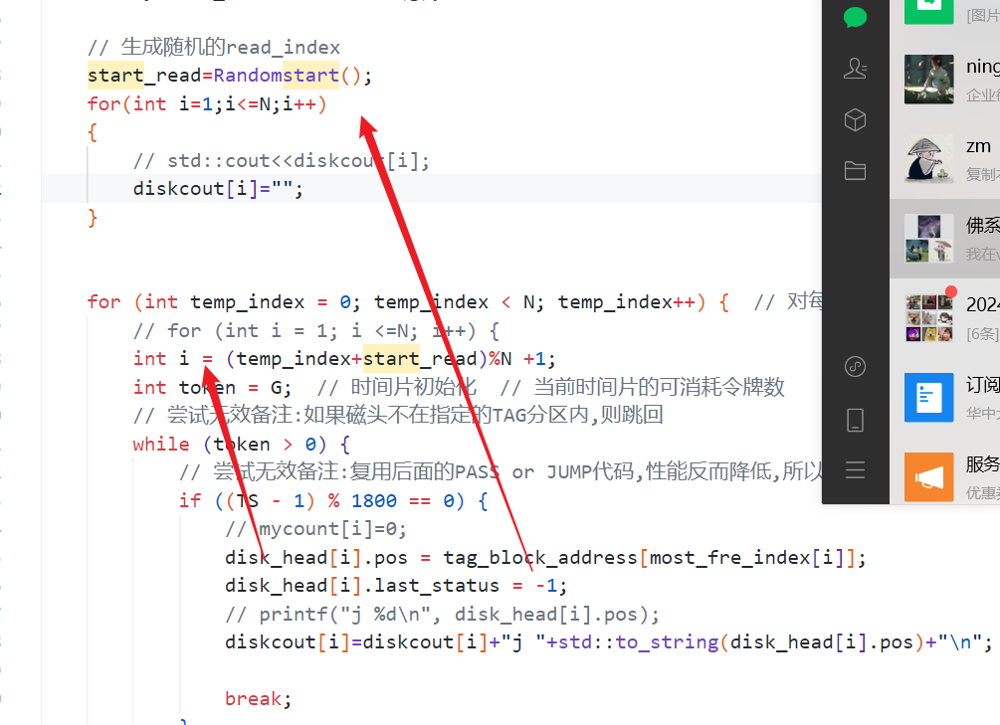

# 软件精英挑战赛2025-----佛系Coding

## 介绍
首先，需要再根目录下建设一个无后缀的文件，如`main_v32`,然后点击`build_run.bat`即可，本项目主要使用C++实现，详细的代码版本在`demos\cpp\main_version`中，可以详细查阅

除此之外，如需了解整个代码的编写过程和逻辑，可以参考本项目的commits：[Commits · yzmninglang/2025-code-craft-preliminary](https://github.com/yzmninglang/2025-code-craft-preliminary/commits/1.0/)

## 主要细节
按照时间顺序编排编写思路

[main_v2](demos/cpp/main_version/main_v2.cpp)
> 1. 基于标签的存储区域划分
​核心思想：将相同标签的对象集中存储在同一硬盘的连续区域
​实现策略：
预处理阶段分析各标签的写入模式，建立标签-硬盘映射表
为每个标签分配主存储硬盘（如标签i%N），并在该硬盘划分专用存储区
写入时优先选择标签对应的主存储硬盘，确保同一标签对象物理相邻
> 3. 智能副本分布算法
​优化点：在保证3副本分布的前提下优化标签聚集性
​选择策略：
第一副本：优先写入标签对应的主存储硬盘
第二副本：选择次存储硬盘（(主+1)%N）
第三副本：选择第三存储硬盘（(主+2)%N）
检查目标硬盘的连续空间，动态调整选择

[main_v3](demos/cpp/main_version/main_v3.cpp)
> 主要优化了一下read动作的逻辑

[main_v8](demos/cpp/main_version/main_v8.cpp)
> 全部可以跑通了

[build_run](build_run.bat)

> 把它放在顶级目录，然后修改main_v?的文件名，双击就可以自动编译main.exe和调用交互器来算分

[main_v9](demos/cpp/main_version/main_v9.cpp)
> 逻辑直接用FIFO实现的,实现丢弃
>

[main_v10](demos/cpp/main_version/main_v10.cpp)
> n_read=0改为继续读取，而不是直接结束

[main_v12](demos/cpp/main_version/main_v12.cpp)
> 空间按比例分配

[main_v14](demos/cpp/main_version/main_v14.cpp)
> 除了分配磁盘之外，我还改了这里，也就是说每过一段时隙，不同磁盘所指向的tag_id会轮流变，这样就能保证能够读到更多的请求。

[main_v15](demos/cpp/main_version/main_v15_best.cpp)
> 之前是当前分区没存完，就从头开始找空位置存，这样碎片化程度太大了.现在改为，如果当前分区存不下，就往后找能存下的分区存下，减小碎片化程度.你的意思是，当前tag分区存不下就往下一个tag分区存了是吗

[main_17](demos/cpp/main_version/main_v17.cpp)
> 试了一下存储空间根据总流量分配，感觉效果不是很好

[main_v18](demos/cpp/main_version/main_v18.cpp)
> 把每个tag区域空闲的连续区域的首地址和大小都维护下来，删除了，要合并相邻的空闲区域；写入时尽量寻找刚刚好连续存完的
如果原tag分区没有足够大的空闲区域存下对象，则优先在此分区碎片化存储，如果连碎片化存储都做不到再去别的分区存。

[main_v20](demos/cpp/main_version/main_v20.cpp)
> 我把read那个写好之后，本地跑出来的数据和之前刘师兄跑出来的一模一样

[main_v21](demos/cpp/main_version/main_v21.cpp)
> 优化了一下tag写，多了点分
>
[main_v25](demos/cpp/main_version/main_v25.cpp)
> 调参调到1481w了

[main_v27](demos/cpp/main_version/main_v27.cpp)

> 因为看了1800~1816这些时间片，发现磁头指向的内容虽然有效，但是可能没有被请求，所以磁头一直在那里不动.因为进不去这个if.之前的bug也来源于此.没有被请求的读不了

[main_v29](demos/cpp/main_version/main_v29.cpp)
> 改了几天那个read取代pass，今天总算是跑通了

[main_v30_randRead](demos/cpp/main_version/main_v30_randRead.cpp)

> 我在v30基础上添加了随机磁盘读

[main_v32](demos/cpp/main_version/main_v32.cpp)

> 在上一版基础上，让它节省一定的token